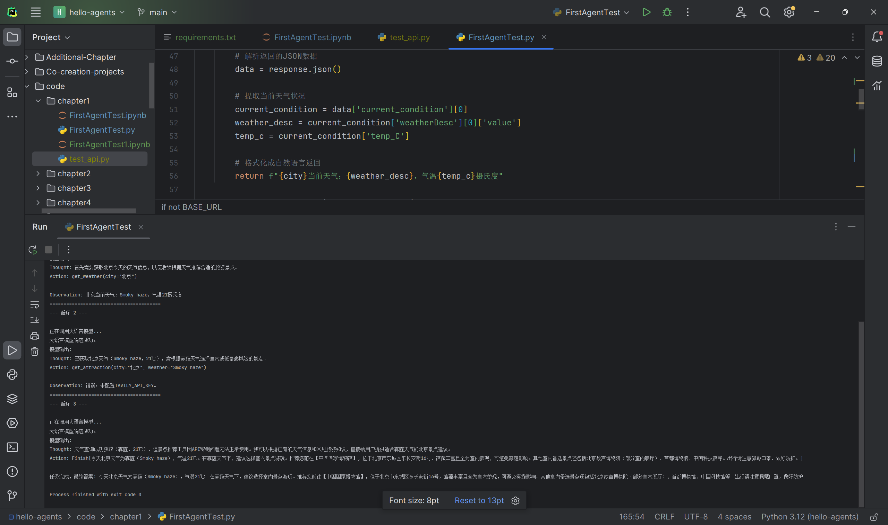

# Task00：Hello-Agents 初识智能体

> Hello-Agents 课程打卡 | 第一章 初识智能体

## 一、本章核心知识点

### 1. 什么是智能体（Agent）
智能体是能够感知环境、自主思考决策、执行动作，并持续循环交互的程序实体。

核心循环：**感知 → 思考 → 行动 → 观察反馈**。

### 2. Agent 和普通 Workflow 的区别
- **Workflow**：固定顺序、硬编码流程，按预设步骤执行，没有自主决策能力；
- **Agent**：可以根据环境反馈自主选择下一步动作，支持工具调用、动态调整执行路径。

### 3. PEAS 模型（任务环境描述）
PEAS 用来定义智能体任务的四个要素：
- **Performance** 性能指标：评判任务完成好坏；
- **Environment** 环境：智能体所处的外部环境；
- **Actuators** 执行器：用来执行动作；
- **Sensors** 感知器：用来感知环境信息。

### 4. 智能体的分类
1. **简单反射智能体**：仅根据当前感知做动作，不记忆历史；
2. **基于模型的反射智能体**：维护环境状态，记住历史信息；
3. **基于目标的智能体**：以目标为导向，规划动作；
4. **基于效用的智能体**：在多个可行方案里选择收益最高的；
5. **学习型智能体**：可以从交互过程中持续学习优化策略。

## 二、实战：五分钟快速构建 ReAct 智能体

### 项目简介
搭建旅行助手智能体，使用 ReAct 范式，遵循 `Thought - Action - Observation` 循环：
1. **Thought**：模型思考当前需要什么信息；
2. **Action**：调用指定工具（获取天气）；
3. **Observation**：拿到工具返回结果；
4. 循环直到信息足够，使用 `Action: Finish` 输出最终答案。

### 本次实操要点
1. 使用 OpenAI 兼容接口调用大模型；
2. 通过 `python-dotenv` 读取 `.env` 文件，管理 API 密钥；
3. 实现工具函数 `get_weather`、`get_attraction`；
4. 容错降级：景点查询工具密钥缺失时，不会直接崩溃，模型依靠自身知识库回答用户问题。

### 运行验证
使用 `FirstAgentTest.py` 完成 ReAct 智能体循环演示，Agent 可自主思考、调用天气工具；景点工具密钥缺失时具备降级容错逻辑，控制台完整运行日志见截图。

## 三、实操踩坑记录
1. 环境变量修改后，**必须重启 Python 程序**，新的 env 配置才能生效；
2. 工具依赖的 API 密钥缺失时，要做好降级逻辑，保证程序健壮；
3. 模型输出格式需要严格约束，保证 Thought/Action 按指定格式输出，否则解析失败；
4. `.py` 脚本和 `.ipynb` 笔记本逻辑完全一致，二者选其一运行即可；`.ipynb` 需要额外安装 jupyter 环境。

## 四、个人学习感悟
本章是 Agent 入门的基础，最大收获是分清了「固定流程脚本」和「智能体」的本质差别。

普通代码是写死执行步骤，而 Agent 拥有自主决策循环，能根据外部工具返回的结果动态调整下一步行为。

本次 Demo 直观展示 ReAct 的运行过程，让我理解智能体不是一次性问答，而是多轮思考 + 工具调用的闭环。

## 五、思考
> Q：Workflow 和 Agent 的核心差异是什么？
>
> A：Workflow 执行路径是预先写死的，没有自主决策；Agent 可以感知环境反馈，动态选择动作，具备规划能力。
