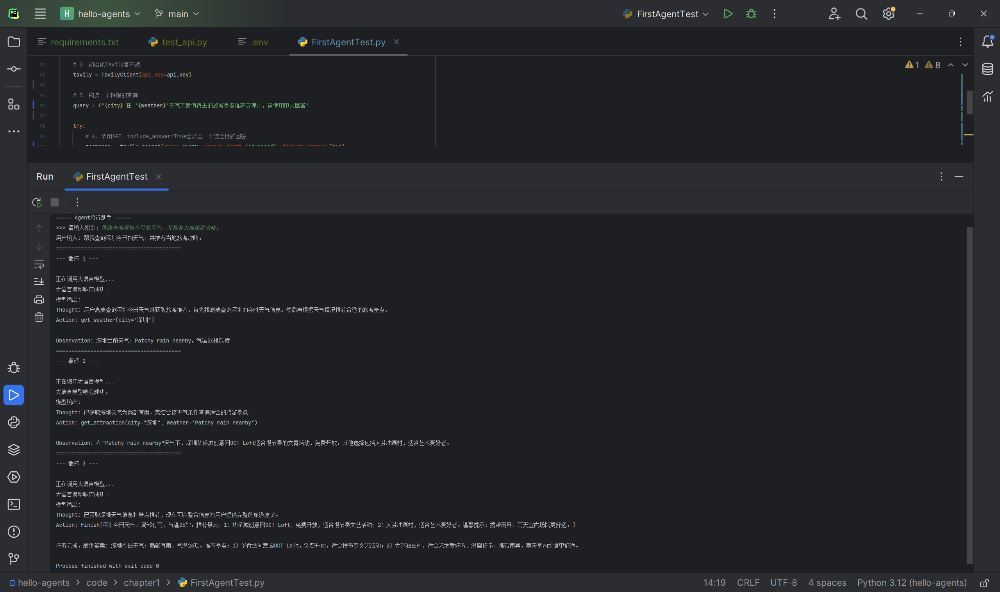

# Task01：五分钟快速构建智能体
> Hello‑Agents课程打卡｜第一章实操拆解
## 一、本章核心知识点
1. ReAct范式循环：Thought‑Action‑Observation‑Finish
- **Thought**：大模型进行内部推理分析，梳理当前还需要哪些外部信息
- **Action**：选择对应的工具并传入参数执行调用
- **Observation**：接收工具返回结果，把外部信息送入上下文
- **Finish**：信息收集完毕，输出最终答案，终止智能体循环
2. 智能体四大组成模块
- LLM大脑：负责推理思考输出Thought；本项目使用魔搭Qwen模型
- Tools工具集：赋予智能体外部能力，案例包含天气查询、景点搜索工具
- Memory记忆模块：`prompt_history`维护每一轮交互上下文
- 循环控制器：设置最大迭代轮次，防范无限死循环
3. 工程要点
> 通过系统提示词约束模型输出格式，再配合正则表达式解析Thought与Action；仅靠提示词不足以完全约束大模型随机性，代码层正则解析是一层重要防护。
> ⚠️正则踩坑点：多行Finish输出，`.`默认不匹配换行符，需要增加`re.DOTALL`非贪婪匹配，否则会出现**模型输出格式异常**。

## 二、实战：旅行助手智能体代码拆解
项目简介：
对FirstAgentTest.py旅行助手Demo逐模块拆解分析
1. `AGENT_SYSTEM_PROMPT`系统提示词：相当于智能体的行为说明书，强制约束输出格式；
2. `available_tools`工具字典：注册全部可用工具函数；
> **两套密钥注意区分，不可混用**
> - LLM‑API‑KEY：给到大模型，负责推理思考
> - TAVILY_API_KEY：给到搜索服务，负责联网检索景点信息
> 👉现状说明：今天申请配置Tavily密钥之后，`get_attraction`可以执行真实联网搜索；无密钥情况下工具调用失败，Agent进入降级逻辑，依赖模型静态知识库给出回答。
3. OpenAICompatibleClient兼容客户端：封装OpenAI协议接口，可以灵活切换各类大模型服务商；
4. prompt_history上下文记忆列表：保存完整交互记录，维持任务上下文；
5. 主循环逻辑：迭代执行ReAct流程，设置最大循环次数，避免死循环。

运行验证：

> ✅今天新跑通的完整链路截图：包含天气查询、Tavily联网获取景点、完整ReAct三轮循环、Finish多行正常输出。

## 三、实操踩坑记录
1. 第三方外部接口属于不稳定依赖（案例wttr.in天气接口出现SSL证书过期）；工程开发要做好降级容错，不能单一工具故障直接让整个Agent任务彻底失败。
2. 大模型输出存在随机性，单纯依靠prompt约束并不绝对可靠，需要代码正则解析做第二层保障；遇到Finish块多行文本，正则需要开启`re.DOTALL`非贪婪模式，解决换行带来解析失败。
3. 分清两套独立密钥：LLM密钥用于推理；Tavily密钥用于网页搜索，二者作用完全不同。
4. Tavily免费额度不要高频反复调用调试，避免快速耗尽配额；

## 四、个人学习感悟
Task00完成基础环境搭建跑通Demo，Task01进一步拆解ReAct智能体整套工程实现。
ReAct智能体不是简单问答，而是一套多轮思考、工具调用、观测反馈的闭环。普通Workflow是写死固定步骤；Agent交由大模型动态做决策。真实工程环境下，不光要看大模型本身能力，工具稳定性、输出格式可控性、异常降级容错逻辑，都是开发智能体不可忽视的现实问题。本次调试过程也体会到Agent健壮性建设的价值，遇到网络、接口、格式问题，要有对应的处理逻辑。

## 五、思考
> Q：开启Tavily搜索工具之后，整个智能体流程发生了什么变化？
> A：配置有效的Tavily密钥后，`get_attraction`工具可以调用联网搜索，拿到互联网实时资讯；没有密钥时工具调用失败触发降级，只能依赖模型训练截止时间之前的静态知识，无法获取实时网络信息。这组对比，直观体现智能体需要考虑工具可用性、降级兜底的健壮性设计。

