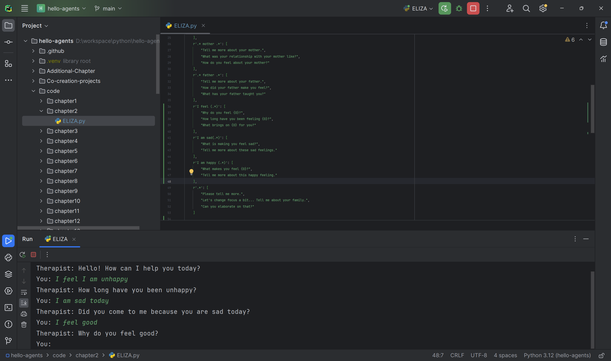
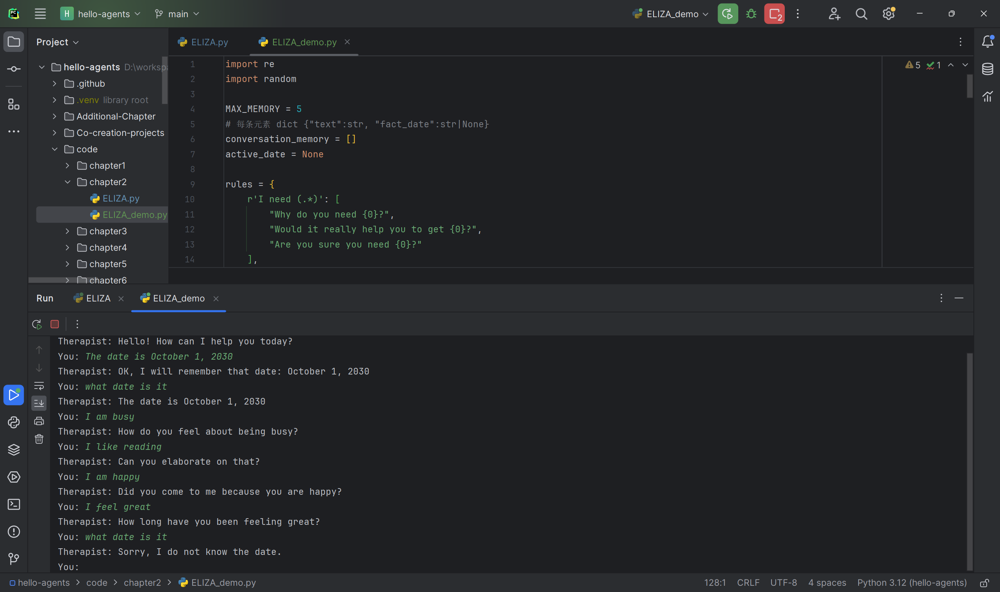

# Task02：ELIZA智能体改造实战
> Hello‑Agents课程打卡｜第二章实操拆解
## 一、本章核心知识点
1. **ReAct范式循环 Thought‑Action‑Observation‑Finish**
- **Thought**：大模型进行内部推理分析，梳理当前还需要哪些外部信息
- **Action**：选择对应的工具并传入参数执行调用
- **Observation**：接收工具返回结果，把外部信息送入上下文
- **Finish**：信息收集完毕，输出最终答案，终止智能体循环

2. ELIZA符号规则式智能体组成
- **规则集合rules**：手写正则表达式与回复模板，符号主义的核心；本次实操分两轮扩展规则库：新增情绪类正则、新增日期查询正则规则；
- **代词转换模块**：`swap_pronouns`，完成人称互换；
- **Memory记忆模块**：改造升级为结构化记忆单元，每条记忆保存原文以及本条产生的业务事实；设置`MAX_MEMORY=5`实现FIFO滑动队列，最多保留最近5轮对话；
- **主循环**：不断读取用户输入、匹配规则、输出回答，对话数量达到上限之后队首消息自动被挤出队列。

3. FIFO滑动记忆窗口概念
采用先进先出队列管理对话，`MAX_MEMORY`控制记忆保留条目数量；新对话入队，最早的旧对话从队首被挤出队列。
>⚠️注意：普通字符串记忆仅仅保存文本；想要业务事实跟随条目过期，需要额外开发逻辑，这是符号规则体系的痛点。

## 二、实战：改造ELIZA
### 改造点清单
#### 阶段1：新增情绪相关正则规则
> 将情绪正则规则添加到源码rules字典中（代码片段自行手动填入）
> 第一张截图说明：仅增加情绪正则，尚未增加记忆与日期规则；测试输入`I feel I am unhappy`、`I am sad today`、`I feel good`，验证情绪正则模板命中效果。

第一张：**增加情绪正则后的运行截图（无结构化记忆）**

#### 阶段2：新增日期查询规则 + 5轮FIFO结构化记忆
业务规则说明：
1. 查询指令：用户输入`what date is it`，返回模拟日期`It is October 1, 2030`；当设置日期的对话被挤出队列，日期事实自动失效。
2. 记忆配置：`MAX_MEMORY=5`，最多保存5条对话。

第二张：**完整改造版本（情绪正则 + 结构化FIFO记忆 +日期查询规则Demo）**

### 核心改造要点（第二阶段记忆&日期改造）
1. 将记忆由简单字符串列表改为结构化字典数组，每条记忆单元结构：`{"text":"用户原文","fact_date": 提取的日期或者None}`；
2. 匹配设置日期规则时，为本条记忆单元打上日期事实标记；
3. 如果队首记忆单元被pop挤出队列，判断该单元是否携带日期事实，如果携带，则清空全局生效日期；
4. 保留全部新增情绪正则规则，增加`what date is it`匹配分支。

## 三、实操踩坑记录
1. **通配符顺序问题**
现象：万能正则`r'.*'`如果放在规则字典靠前位置，会优先捕获所有输入，导致后面自定义规则永远无法触发。
解决：规则字典遵循**优先级从高到低**，兜底正则放到字典最后。

2. **单词级代词替换的局限性**
`swap_pronouns`只做简单单词替换，适合短句场景；遇到复杂长句语法会错乱，属于ELIZA原生实现缺陷。

3. **仅英文正则规则**
整套正则面向英文输入，输入中文无法命中自定义规则，直接走兜底回复。

4. **结构化记忆的业务硬编码局限**
>实操现象：设置最大记忆轮数`MAX_MEMORY=5`。当设置日期的对话条目被FIFO记忆窗口挤出之后，日期事实自动失效，再次查询日期返回`Sorry, I do not know the date.`，无需手动清除。
>局限说明：该过期逻辑属于**针对日期的定制开发**。系统只能识别预先定义好的这一类事实；新增其它业务事实，就要手动扩展字段、标记、过期逻辑。规则驱动智能体没有通用语义能力，无法自动实现事实过期。对比大模型：大模型依靠完整上下文文本，窗口淘汰原始文本，依附文本的信息随之失效，不需要为每一类事实单独写过期逻辑。

## 四、个人学习感悟
ELIZA是早期符号主义智能体，全部能力依靠人工编写正则和回复模板。第一阶段增加情绪正则完成规则库扩展；第二阶段实现FIFO结构化记忆改造，增加日期查询能力。想要做到业务事实随记忆过期销毁，需要针对场景做定制开发。符号方案优点逻辑可控；短板明显：每新增一类业务都要人编写代码，缺少通用语义理解能力。现代大模型Agent融合两种思路，依靠大模型语义能力实现更加通用记忆效果。

## 五、思考
> Q：为什么ELIZA不能天然做到事实跟随记忆窗口自动过期？
> A：普通字符串记忆仅存储原始对话文本，ELIZA符号规则体系不存在通用的语义事实管理机制。业务事实被解析之后会保存在独立的全局变量，与原始对话文本相互脱离。如果要实现事实随记忆条目过期失效，必须由开发者手动实现事实绑定、销毁逻辑，系统无法自动完成该行为。

> Q：对比大模型上下文窗口机制，二者核心差异是什么？
> A：大模型将完整对话全部送入Prompt，当对话滑出上下文窗口，对应的文本连同依附其上的全部信息一同失效，属于通用原生机制；ELIZA符号规则体系，每一类业务事实的过期清除逻辑都需要手动硬编码开发。

> Q：ELIZA对比ChatGPT，列举3点本质差异
> A：
> - **知识来源**：ELIZA的全部能力依赖人工手写正则与回复模板，不存在自主学习能力；ChatGPT从海量文本数据中通过预训练习得知识，知识来源于数据而非人工逐条编写。
> - **语义理解能力**：ELIZA仅做字符串模式匹配，并不真正理解语义，无法处理否定、歧义与复杂上下文；ChatGPT具备语义理解能力，可以理解否定表达、歧义语句与多轮上下文信息。
> - **系统可扩展性**：ELIZA想要新增对话能力就要不断扩充规则库，极易产生规则冲突；大模型依靠预训练权重，能够泛化处理从未见过的输入场景，不需要逐条编写规则。

> Q：为什么开放域对话场景，规则方法会发生组合爆炸难以维护？
> A：开放域对话下用户的话题、句式、词语组合几乎无穷无尽。假设存在N类话题，每一类话题下有M种句式变体，那么需要的规则量级约为 $O(N\times M)$。话题与表达方式越多，规则数量会呈乘积式快速膨胀；同时大量规则之间会产生优先级冲突，调试、排错、维护成本急剧上涨，人力无法穷举人类全部表达方式，最终引发组合爆炸问题。
