# Task04：智能体经典范式构建
> Hello‑Agents课程打卡｜第四章完整笔记（理论阅读 + 代码实操）

## 一、本章核心知识点
### 1. 为什么要手写Agent范式，而不是直接使用LangChain/LlamaIndex
1. 框架做了大量封装，隐藏了Agent工程真正的难点：LLM输出格式解析、工具参数校验、循环终止保护、异常重试；
2. 手写实现可以理解底层运行机制，未来遇到框架不满足业务需求时，可以自主定制；
3. 理解三种范式的取舍，做业务选型时知道该选哪一种范式，而不是盲目套框架。

### 2. ReAct范式（Reasoning + Acting）
- 核心循环：`Thought(思考) → Action(工具调用) → Observation(工具返回结果)`，循环往复直到Finish输出最终答案。
- 核心价值：思考指导行动，行动返回的事实反过来修正思考，解决纯CoT幻觉问题。
- 适用场景：需要实时外部信息、工具调用、API交互的任务；例如联网搜索、计算器查询。
- 现存局限：
  1. 高度依赖LLM严格输出Thought/Action固定格式；正则解析很脆弱，一旦输出格式错乱整个流程直接失败；
  2. 串行多轮LLM调用，token消耗与延迟上涨；
  3. 缺少全局规划，容易陷入局部最优甚至无限循环，必须设置max_steps最大步数作为安全阀。
- 关键组件：提示词模板、工具执行器ToolExecutor、输出解析器、循环终止判断。

### 3. Plan‑and‑Solve范式（先规划，后执行）
- 核心流程：用户问题 → Planner生成完整静态分步计划 → Executor严格按计划一步一步执行，每一步保存历史结果传给下一步。
- 适用场景：任务逻辑路径清晰、可以拆解成子步骤；数学应用题、报告大纲撰写、代码分模块实现。
- 现存局限：
  1. **计划是一次性静态生成**，执行途中如果某一步失败，原生实现没有重规划机制，会带着错误计划一路执行到底；
  2. 依赖规划阶段LLM拆解任务的质量，计划拆分不合理后续全部失效。

### 4. Reflection反思迭代范式
- 核心循环：`初始执行生成初稿 → Reflection反思评审（扮演评审专家找问题） → Refinement根据反馈优化版本`，循环至无需改进或达到最大迭代次数。
- 适用场景：对输出质量要求极高，对延迟不敏感；代码优化、论文/报告撰写、复杂推理校验。
- 成本收益：
  ✅收益：把普通初稿迭代为高质量结果，发现逻辑、算法、事实漏洞；
  ❌成本：每轮迭代至少2次LLM调用，成本、耗时显著增加；提示词设计复杂度上升。

### 5. 三种范式横向对比
|范式|思考行动模式|典型适用任务|主要风险|
|---|---|---|---|
|ReAct|边思考边行动，走一步看一步|联网搜索、工具交互、探索类任务|格式解析失败、循环死循环、调用成本高|
|Plan‑and‑Solve|先生成完整静态计划，再分步执行|结构化可拆解任务、数学题、报告撰写|静态计划出错，无法动态重规划|
|Reflection|执行‑评审‑优化迭代循环|代码生成优化、报告修订、高严谨度推理|API调用开销大、延迟高|

>业务混合范式思路：工业界很少单独使用某一种；常见组合：Plan‑and‑Solve做顶层大计划，子步骤内部使用ReAct做工具调用，关键步骤加入Reflection做质量校验。

## 二、实操记录
### 2.1 ReAct 智能体Demo
实验输入问题：**华为最新的手机型号及其主要卖点**
完整执行流程：
1. 第一轮Thought识别该问题需要实时互联网信息，Action调用Search网页搜索工具；Observation拿到网页返回搜索结果。
2. 第二轮Thought解析搜索返回内容，整合信息，执行`Action:Finish`输出最终回答，ReAct循环结束。

完整运行日志拆分4张截图：
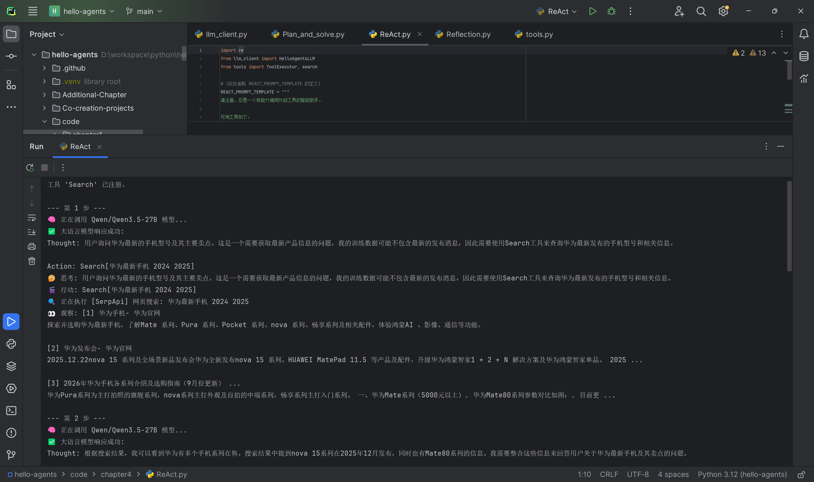
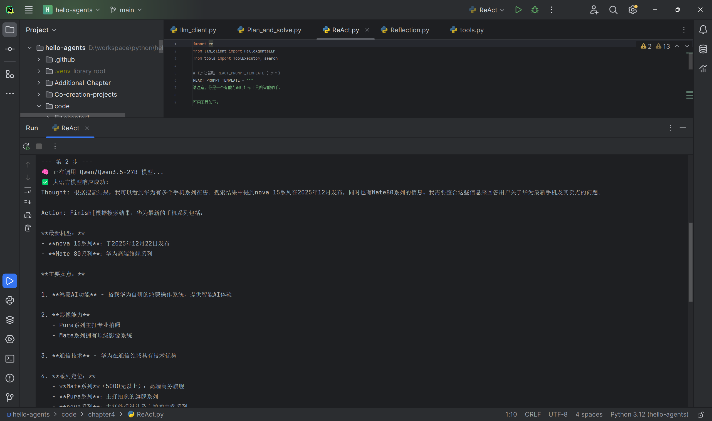
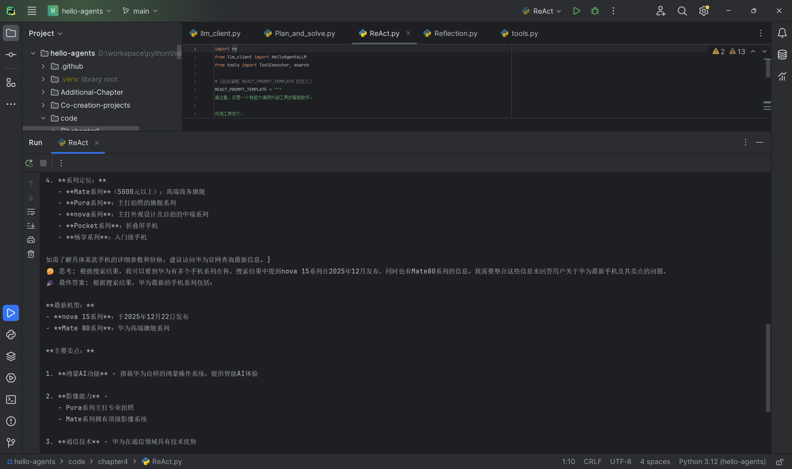
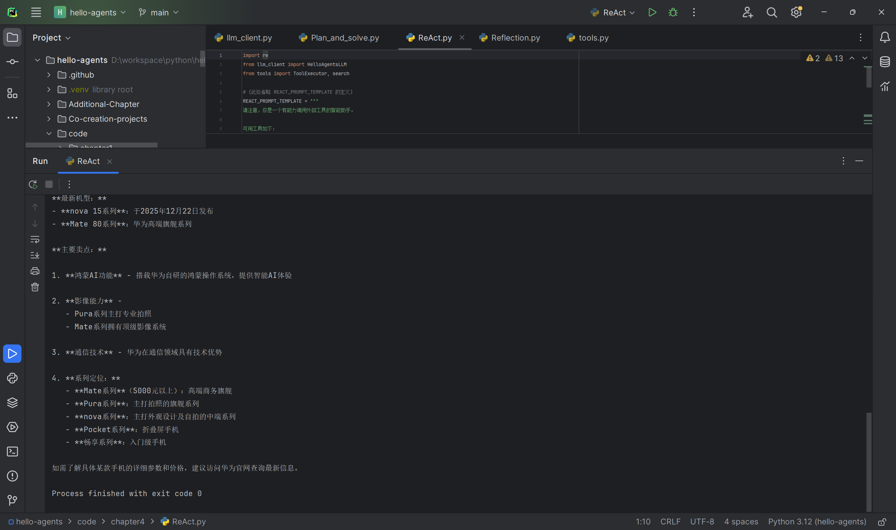

### 2.2 Plan‑and‑Solve 智能体Demo
实验输入问题：**一个水果店周一卖出了15个苹果。周二卖出的苹果数量是周一的两倍。周三卖出的数量比周二少了5个。请问这三天总共卖出了多少个苹果？**
完整执行流程：
1. 规划阶段：Planner将应用题拆解为4步结构化执行计划；
2. 执行阶段：Executor按计划分步执行，每一步保存上一步结果作为上下文输入，最终计算得到总销量结果。

运行截图：

### 2.3 Reflection 智能体Demo
实验任务：**编写一个Python函数，找出1到n之间所有的素数**
完整执行流程：
1. 初始执行：生成试除法查找素数的初稿代码；
2. 第一轮Reflection评审：指出试除法时间复杂度缺陷，提出埃氏筛优化方案；
3. Refinement优化：生成埃拉托斯特尼筛法代码；
4. 多轮迭代反思，继续评估筛法可优化点，直到反思输出“无需改进”，迭代终止。

完整运行过程截图：
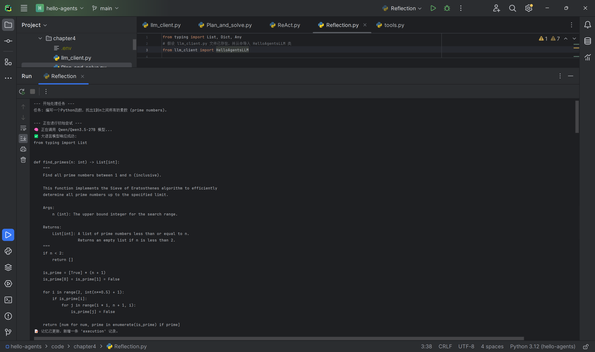
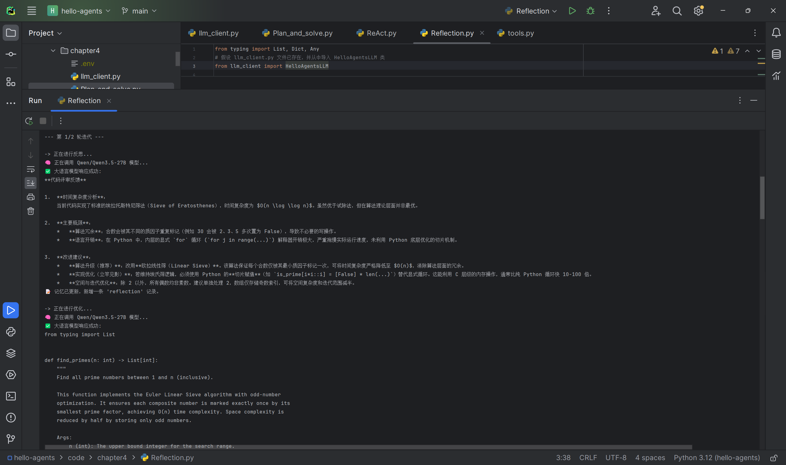
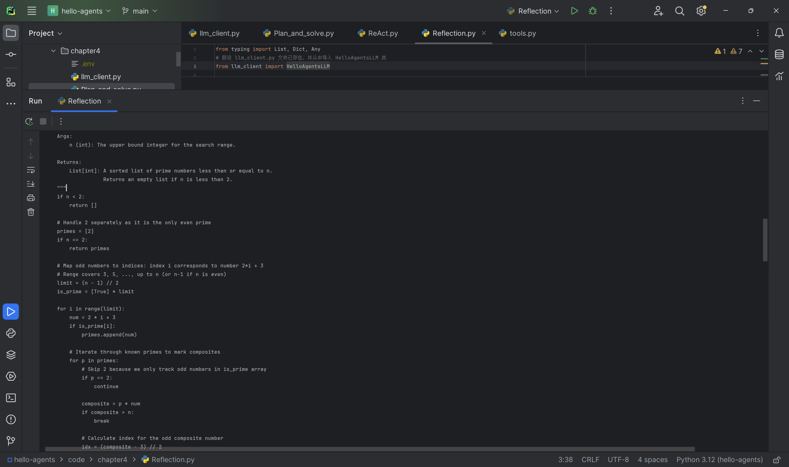
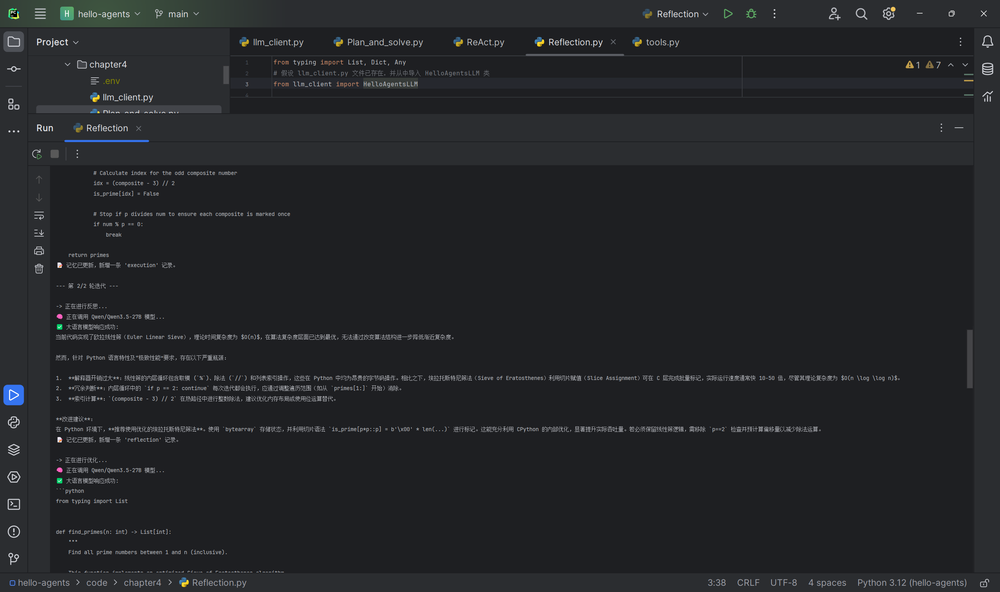
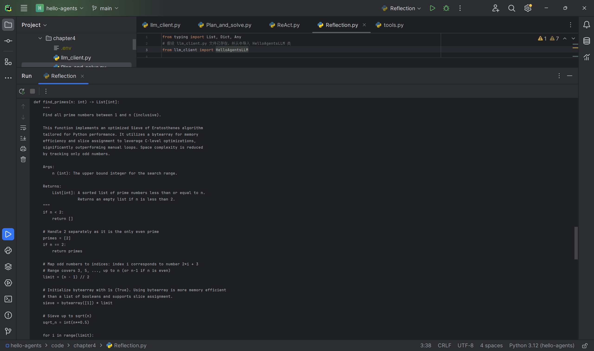
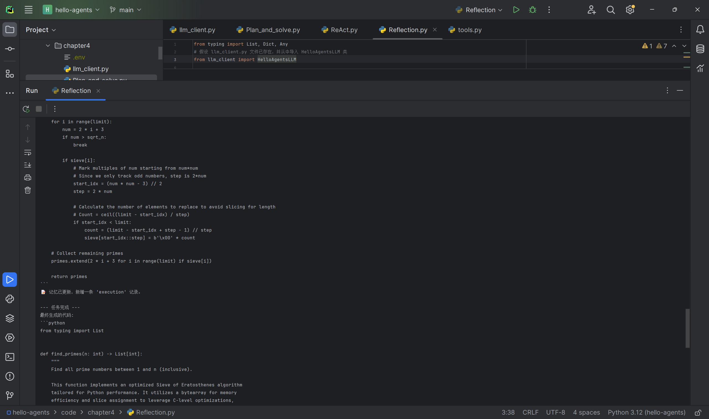
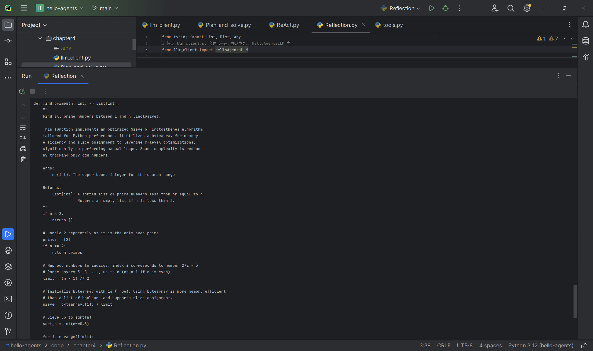
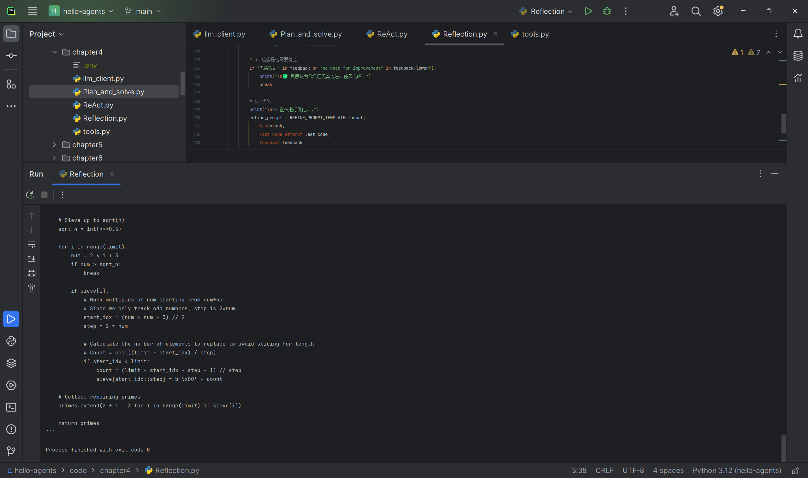

>小结：本章三大范式ReAct、Plan‑and‑Solve、Reflection均已完成代码运行实验，全部运行截图存放于`./assets`目录。

### 待拓展实操
1. ReAct拓展：为ReAct Agent新增计算器工具，实现数学计算工具调用；模拟工具调用失败重试机制；研究工具数量50‑100个场景下工具检索优化方案。
2. Plan‑and‑Solve拓展：实现动态重规划、分层规划逻辑。
3. Reflection拓展：搭建论文写作多维度反思评审机制；测试执行模型与评审模型分离的效果。

## 三、个人学习感悟
理解Agent的核心：**LLM是大脑，工具是手脚，提示词+状态机管理历史轨迹，组合起来才构成完整智能体**。
后端对接Agent系统的设计思路：状态管理、工具封装、调用链路、失败重试、限流保护。
三种范式各有取舍，没有万能范式。真实业务一般会采用混合架构：顶层做规划，子步骤做工具调用，关键产出加入反思校验。

## 四、课后习题
> Q1‑1：三种范式组织思考与行动的本质区别？如果设计智能家居控制助手选什么范式？三种范式能否组合，设计混合范式架构？
> A：
> 1. ReAct：思考和行动交替穿插，每一轮思考之后立刻执行行动，拿到观察结果再进入下一轮思考；没有全局完整计划。
> Plan‑and‑Solve：思考（规划）全部前置，一次性产出完整计划，后续只负责执行，执行阶段不再做大的思考规划。
> Reflection：先完整产出结果，**事后再做思考评审**，基于评审反馈重新优化输出，思考发生在产出之后。
> 2. 智能家居控制助手推荐**Plan‑and‑Solve为主，局部嵌入ReAct**。用户下达指令，先生成完整设备动作计划；执行过程中如果传感器返回异常观测结果，局部用ReAct动态调整单步动作。不需要Reflection，家居控制追求低延迟，反思迭代带来额外开销没有业务收益。
> 3. 可以组合。混合范式示例：顶层Plan‑and‑Solve生成整体任务计划；每一个子步骤内部启用ReAct，调用设备工具、读取传感器Observation；对重要高风险的执行结果，启用Reflection做校验修正。适用复杂家庭自动化、企业工作流Agent。

> Q2‑1：ReAct正则解析输出有什么脆弱点？什么场景解析失败？除正则还有什么更鲁棒的解析方案？
> A：
> 脆弱点：正则强依赖模型严格输出`Thought:`、`Action:`固定标记。
> 失败场景：
> 1. LLM额外增加多余解释文字；
> 2. 换行、空格、markdown格式变化；
> 3. 模型忘记输出Action字段，输出自由文本；
> 替代方案：
> 1. 强制模型输出JSON格式，JSON解析比正则稳定；
> 2. Prompt加入few‑shot示例，给完整输出样例约束模型；
> 3. 增加解析失败重试逻辑，重新把错误原始输出丢回模型，要求重新格式化输出。

> Q2‑2：为ReAct增加计算器工具；工具调用失败处理；工具数量膨胀到50‑100个如何优化工具检索？
> A：
> 1. 新增计算器工具：封装数学计算python函数，注册进ToolExecutor，补充工具描述，告诉LLM遇到数学计算要调用Calculator[表达式]；
> 2. 工具调用失败机制：记录连续错误调用次数，超过阈值，返回提示给LLM，提示工具参数错误，引导修正参数；多次失败直接终止流程，避免无限重试；
> 3. 工具数量达到几十上百个：不把全部工具描述一次性塞给prompt。增加工具检索层：根据用户子任务做向量检索，只把相关性最高的N个工具描述喂给LLM，减少prompt长度，降低LLM混淆概率。

> Q3‑1：Plan‑and‑Solve静态计划，执行步骤失败如何设计动态重规划？
> A：每一步执行结束之后，增加结果校验；如果步骤执行失败/结果不符合预期，触发重规划：把原始问题、已经执行过的步骤、失败步骤的错误信息交给Planner，**局部重新生成后续子计划，保留已经成功执行完成的步骤，不需要全部推倒重来**。

> Q3‑2：预订北京到上海差旅任务，对比ReAct和Plan‑and‑Solve哪个更合适？
> A：优先Plan‑and‑Solve。订机票、酒店、租车任务业务步骤是高度结构化：查航班→预订机票→查询酒店→预订酒店→查询租车→租车。适合一次性生成完整计划。但是每一步调用外部预订API的时候，子步骤内部可以用ReAct处理API返回异常，动态调整筛选条件。

> Q3‑3：分层规划：高层抽象计划，再生成子步骤详细子计划，优势？
> A：
> 1. 解决大任务一次性拆解粒度太粗或者太细碎问题；
> 2. 高层只关心大阶段，子阶段交给子规划器细化；
> 3. 某一个子阶段失败，只需要重规划当前子任务，不干扰上层大计划；
> 4. 上下文窗口受限，分层可以控制单次prompt长度。

> Q4‑1：Reflection，执行模型和反思评审使用两个不同模型会带来什么影响？
> A：可以拆分职责：执行模型选用轻量快速低成本模型用来生成初稿；反思评审使用更强、成本更高的大模型，专门负责找漏洞、算法缺陷。
> 收益：整体成本平衡，大量初稿生成不浪费强模型；强模型只负责评审环节。风险：两个模型知识对齐问题，如果评审模型不理解初稿代码逻辑，会给出错误反馈。

> Q4‑2：Reflection终止条件依靠“无需改进”关键词匹配是否合理？怎么设计更智能终止条件？
> A：单纯关键词匹配不够鲁棒，模型换一套措辞就无法触发停止。
> 优化方案：
> 1. 让反思输出结构化JSON，字段包含`是否继续优化(bool)` + `改进建议文本`，不要靠自然语言关键词；
> 2. 设置最大迭代次数作为兜底硬上限，防止无限迭代；
> 3. 增加质量评分字段，当反思给出的质量分数达到业务阈值自动停止。

> Q4‑3：论文写作助手Reflection多维度反思设计。
> A：设置多维度评审，每一轮反思分别从：段落逻辑连贯性、方法创新点、学术引用规范、语言表达流畅度；每轮可以只聚焦一个维度评审，输出结构化反馈，再交给模型修订；同时设置迭代上限。

> Q5：ReAct提示词、Plan‑and‑Solve提示词差异，如何服务各自范式；角色设定few‑shot对输出的影响。
> A：
> 1. ReAct提示词重点：罗列全部工具，严格规定Thought/Action/Finish输出格式，预留history历史槽位，每一轮循环都把历史Action‑Observation全部注入prompt；核心目标让模型做一轮一轮的工具决策。
> 2. Plan‑and‑Solve提示词：目标是**一次性输出结构化步骤列表（python列表）**，不需要工具描述；重点约束输出结构化计划，不需要历史循环槽位；目标是任务拆解。
> few‑shot示例作用：给模型现成正确输出样例，大幅提升模型遵循指定格式概率；角色设定会改变模型的侧重点，例如代码评审专家侧重性能，开源维护者侧重可读性。

> Q6：电商退款客服Agent，选择什么范式组合？需要哪些工具？提示词怎么设计？上线风险与降风险手段。
> A：
> 范式组合：**Plan‑and‑Solve顶层做业务流程计划；关键决策争议点启用Reflection反思校验；子步骤内部ReAct调用业务工具**。
> 需要工具：
> ①订单查询工具：输入订单ID，返回订单、物流、用户信息；
> ②退款政策查询工具：查询公司退款业务规则；
> ③邮件发送工具：生成回复邮件发送给客户；
> ④置信度评估工具：判断当前退款决策是否存在争议。
> 提示词设计：系统prompt明确业务角色，严格遵循公司退款政策，态度友好，禁止越权做政策之外承诺；
> 风险：错误审批退款造成资金损失；幻觉编造订单信息；用户诱导越权操作。
> 降风险：关键退款决策不直接交给LLM，工具层做业务规则硬校验；争议场景强制触发Reflection二次评审；记录完整Agent轨迹日志便于事后审计；设置业务权限隔离，LLM只做决策建议，最终资金操作交给后端业务系统。
