# Task06：框架应用开发实践
> Hello‑Agents课程打卡｜第六章完整笔记（理论阅读 + 框架实操）

## 一、本章核心知识点
### 1. 为什么要使用智能体框架
第四章手写原生ReAct、Plan‑and‑Solve、Reflection脚本，可以吃透底层原理，但面向真实项目会遇到明显瓶颈：
1. 重复编写Agent主循环、状态管理、工具调用、日志、异常处理等底层基建代码；
2. 多个不同智能体项目，代码难以复用；
3. 长会话下上下文、持久记忆、调试可观测性全部需要自己从零实现。

框架本质：提供一套经过验证的**规范与抽象**。把智能体通用能力封装，开发者只聚焦业务逻辑。

框架带来四大价值：
1. **提升复用与开发效率**：提供Agent基类/执行器，ReAct等范式开箱即用；
2. **组件解耦、易于扩展**：模型层、工具层、记忆层互相隔离，可以随意替换模型、切换记忆策略；
3. **标准化复杂状态管理**：处理上下文窗口、多轮对话持久化等棘手问题；
4. **增强可观测性与调试能力**：回调钩子捕获LLM启动、工具调用结束等生命周期事件，替代零散print打印。

> 重要：框架不是完全替代手写代码，是更高层级抽象，手写理解原理 + 框架做工程落地可以互相配合。

### 2. 四大主流智能体框架定位对比
|框架|核心设计思想|协作模式|控制方式|优势|局限|适合场景|
|---|---|---|---|---|---|---|
|**AutoGen**|**对话驱动协作**|多智能体群聊对话涌现|隐式控制，靠system message定义角色|角色分工简单，贴近人类团队沟通；Human‑in‑loop原生支持|对话存在不确定性，调试依赖完整对话历史|多角色团队协作、创意类任务、软件模拟团队|
|**AgentScope**|**工程化优先，消息驱动架构**|MsgHub消息中心做消息路由|消息异步编排|原生分布式、容错、高并发，生产级运行时|学习门槛高，存在过度工程风险|大规模多智能体、线上稳定服务部署|
|**CAMEL**|**角色扮演Inception Prompting**|双智能体自主角色扮演协作|依靠初始引导提示约束交互逻辑|少量配置就实现深度自主协作，代码轻量|大规模多智能体能力弱，高度依赖提示质量|双专家深度协作、创作类任务（写论文、电子书）|
|**LangGraph**|**有向图状态机**|节点+边显式定义工作流|显式控制，条件边实现循环分支|天然支持循环、反思迭代；流程可审计可追溯|需要写较多模板代码，流程是预定义，缺少涌现行为|业务审批、流水线、反思修正类Agent，需要可控的生产系统|

> 两条核心设计权衡：
> 1. **涌现式协作（AutoGen / CAMEL）**：定义角色与目标，行为从对话中自然涌现，灵活，但结果不可完全预测；
> 2. **显式控制（LangGraph）**：明确写清节点、跳转条件，可靠性高、可审计，但缺少灵活涌现；
> 3. AgentScope代表**工程化维度**：无论什么协作范式，上线生产都要解决并发、容错、分布式部署。

### 3. 关键概念速记
1. **Agent Loop**：智能体思考‑工具调用‑观察‑再思考的主循环；
2. **Message / MsgHub**：消息驱动架构，把智能体交互抽象成消息收发，支持点对点、广播；
3. **Inception Prompting（CAMEL）**：给协作双方植入一套完整初始约束提示，规范对话流程；
4. **StateGraph / TypedDict（LangGraph）**：全局共享状态对象，所有节点读写同一份状态；
5. **Node / Edge / Conditional Edge**：LangGraph的节点、普通边、条件分支边，实现循环、路由；
6. **Human‑in‑the‑loop**：人类介入流程，做审核、确认、干预。

## 二、实操记录
> 本章源码目录说明：chapter6包含4套Demo
> - AgentScopeDemo：三国狼人杀游戏案例
> - AutoGenDemo：模拟软件研发多智能体团队案例
> - CAMEL：电子书写作案例
> - Langgraph：对话系统案例
### 2.1 AutoGen框架实操
> 实验目标：搭建模拟软件开发多智能体团队，产品经理、工程师、代码审查员、用户代理协作完成比特币价格Streamlit应用。
> 环境要点：项目内`.env`可复用之前兼容OpenAI协议的大模型配置；非OpenAI模型需要手动补全`model_info`模型能力描述；每个Demo自带独立`requirements.txt`。
**图片文件名说明：**
- `task06_autogen_run_01.png`：程序初始化、下发业务需求截图
- `task06_autogen_run_02.png`：ProductManager产品经理输出需求分析截图
- `task06_autogen_run_03.png`：Engineer工程师输出完整项目代码截图
- `task06_autogen_run_04.png`：CodeReviewer代码审查员输出评审报告截图

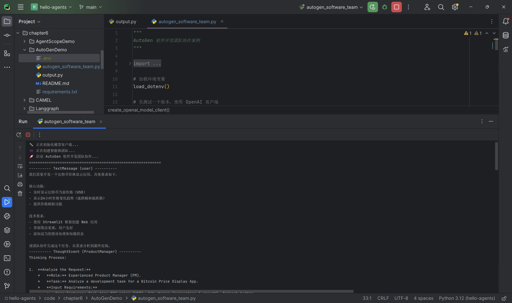
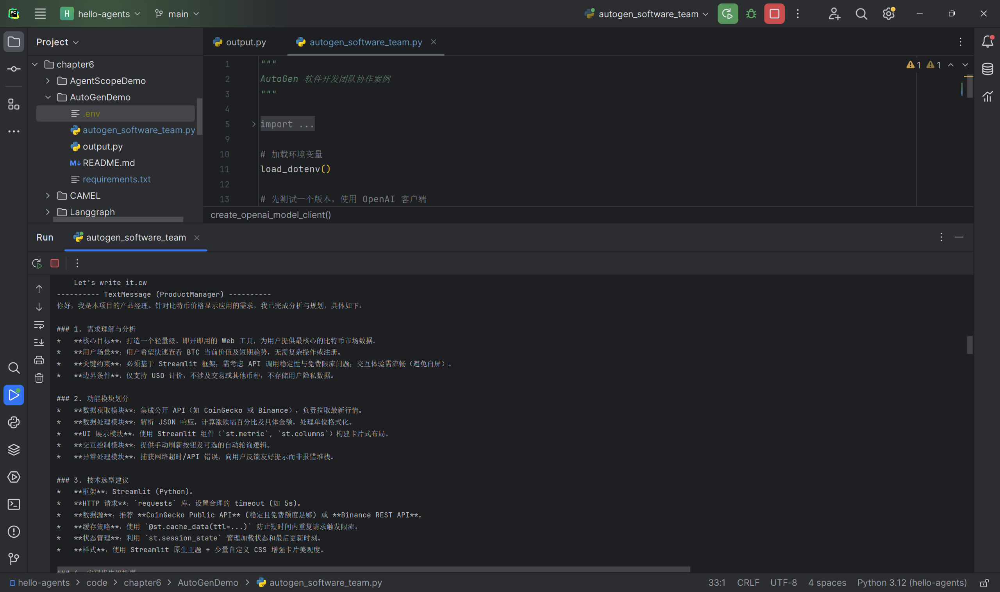
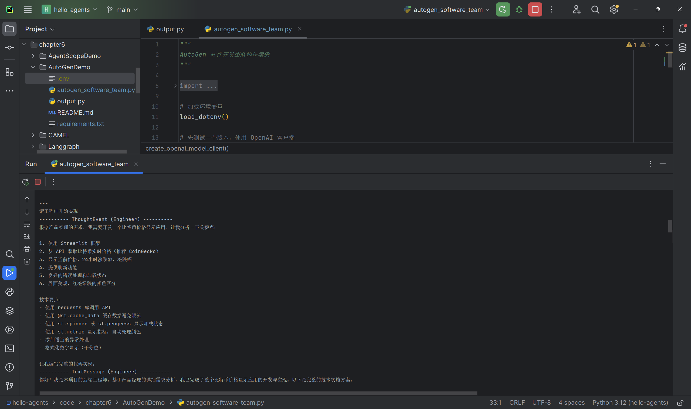
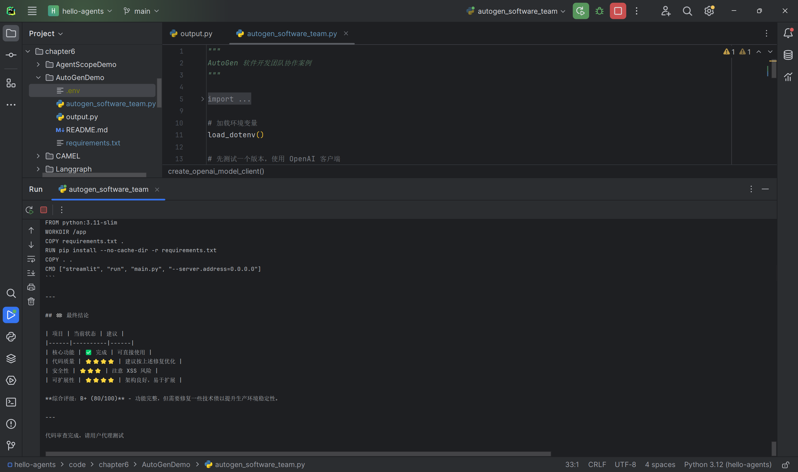

实操记录：
1. 环境：本地venv虚拟环境，使用Qwen/Qwen3.5‑27B，接口使用OpenAI兼容协议；
2. 现象：多智能体群聊完整流转，产品经理需求拆解、工程师编写完整Streamlit项目代码、代码审查员完成bug定位与修复方案输出；
3. 遇到现状：
    - 国产非OpenAI模型，必须手动配置完整`model_info`字段，否则抛出模型信息缺失异常；
    - 控制台仅打印对话文本，**不会自动将代码落盘写入本地py文件**；
    - Qwen模型无法稳定输出`TERMINATE`终止标记，不会自动结束群聊，需要手动`Ctrl+C`终止脚本；运行过程存在版本相关UserWarning警告，不影响主流程；
    - autogen‑core强制锁定protobuf低版本，会带来依赖包版本冲突，不可手动升级protobuf。
4. Demo对话流程完整跑通，但没有完成端到端从代码生成→本地文件写入→实际运行Streamlit应用的完整闭环。

### 2.2 AgentScope框架实操
> 实验目标：三国狼人杀多智能体游戏，体验MsgHub消息中心、并行流水线、结构化输出约束角色行为。
> 实操对象：AgentScope三国狼人杀Demo
**图片文件名说明：**
- `task06_AgentScopeDemo_werewolf_run_01.png`：游戏初始化、第一回合黑夜阶段截图
- `task06_AgentScopeDemo_werewolf_run_02.png`：角色对话、输出 JSON 片段截图
- `task06_AgentScopeDemo_werewolf_run_03.png`：程序运行过程中输出的智能体消息与状态流转截图
- `task06_AgentScopeDemo_werewolf_run_04.png`：模型返回结果、异常提示与程序继续执行截图

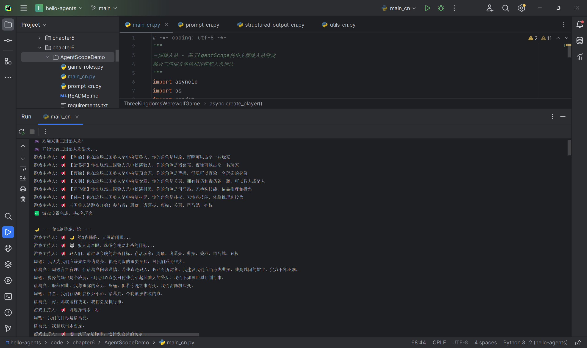
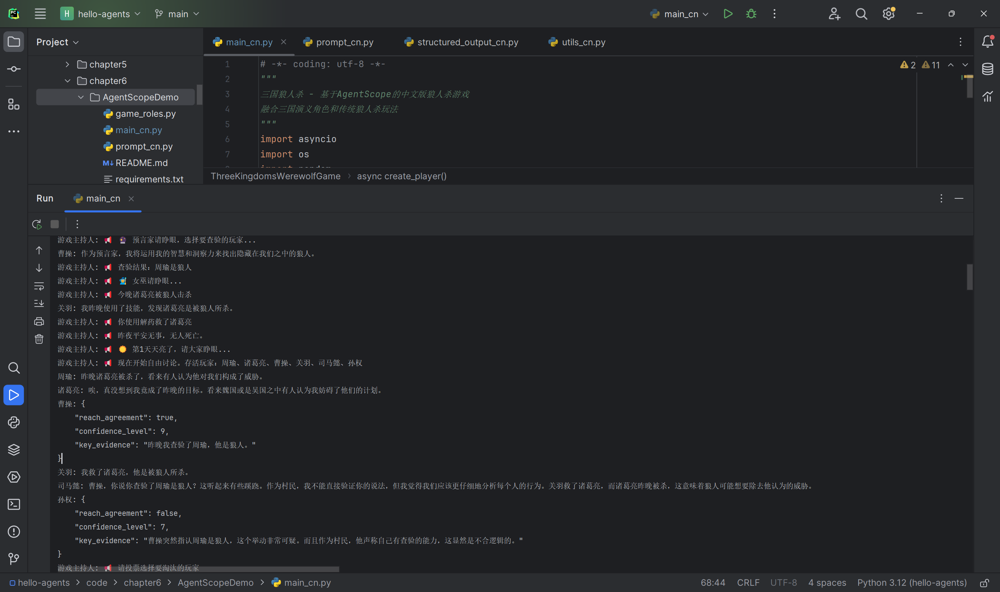
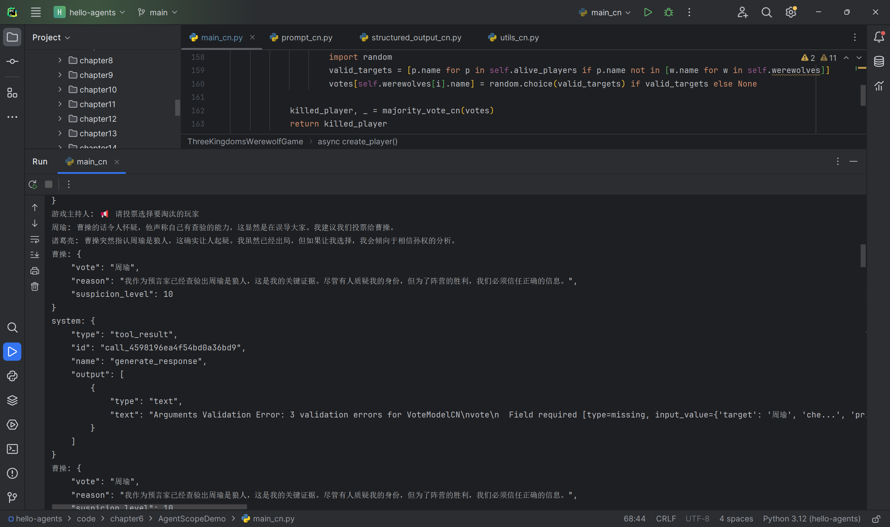
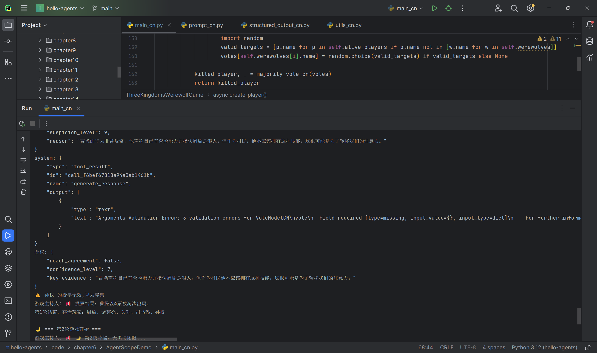

实操记录：
1. 环境：本地venv虚拟环境，调用阿里云百炼业务空间大模型API；
2. 现象：整体游戏流程完整跑通，狼人行动、预言家查验、女巫救人、白天角色讨论投票整套逻辑正常流转；
3. 遇到现状：部分大模型返回JSON文本格式不够干净，存在多余换行；程序运行中出现字段校验异常或模型输出格式告警，但没有崩溃，仍然继续向下执行；

### 2.3 CAMEL框架实操
> 实验目标：CAMEL角色扮演模式，心理学家、作家双Agent，自主协作生成拖延症科普电子书。
> 说明：理解`RolePlaying`会话、inception prompting、终止标记；调试发现效果高度依赖大模型能力与提示词质量。
**图片文件名说明：**
- `task06_camel_run_01.png`：第一轮输出，生成电子书大纲
- `task06_camel_run_02.png`：大纲完整输出下半部分
- `task06_camel_run_03.png`：进入最后一轮，开始撰写引言章节，写作说明

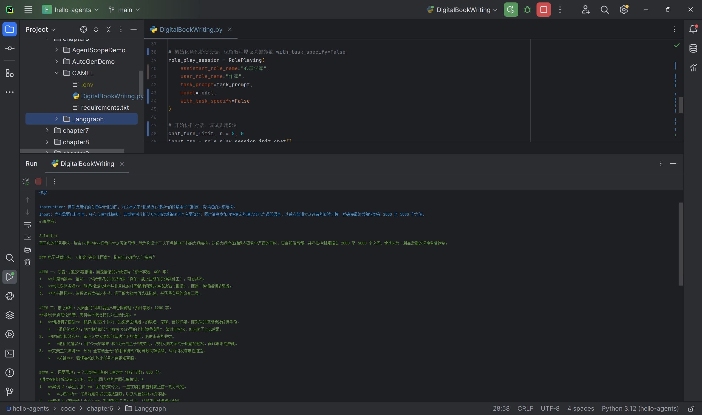
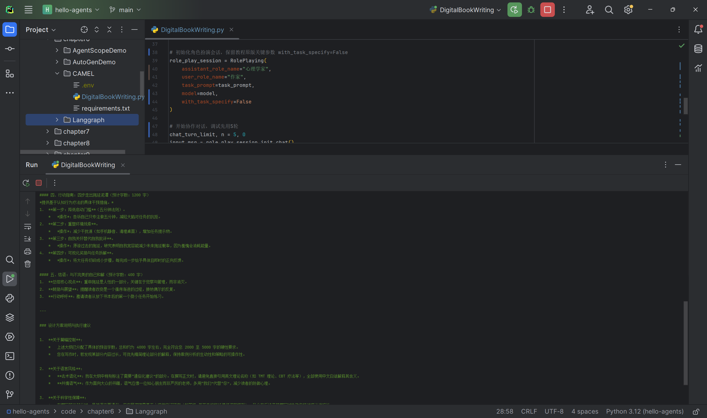
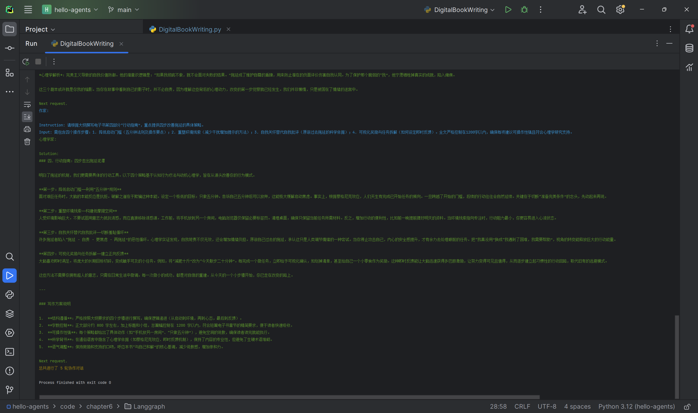

实操记录：
1. 环境：本地venv虚拟环境，使用Qwen/Qwen3.5‑27B魔搭OpenAI兼容接口；
2. 现象：双智能体作家与心理学家开始协作，第一轮输出整本电子书完整大纲，第二轮开始撰写引言章节；
3. 遇到现状：框架输出黄色内部告警日志`Invalid or missing max_tokens in model_config_dict`，属于框架层面告警，不会阻断对话执行；本次只执行部分轮次。

### 2.4 LangGraph框架实操
> 实验目标：实现三步问答助手StateGraph，节点分为理解查询、搜索、生成回答；学习TypedDict全局状态、条件边逻辑。
> 说明：搭建Demo需要Tavily搜索API密钥以及LLM环境变量配置。

实操记录：
1. 环境：本地venv虚拟环境，`langgraph==1.0.0a3`alpha预发布版本；已正确配置`.env`内`TAVILY_API_KEY`密钥；
2. 现象：程序可以正常启动，进入交互输入界面；存在`LangChainPendingDeprecationWarning`版本弃用警告，为库版本历史遗留问题，不影响程序启动；大模型理解查询节点可以正常执行；调用Tavily搜索节点时出现`Request timed out`网络请求超时；
3. 问题定位：同一项目下chapter1脚本可正常调用Tavily；怀疑langgraph异步`astream`运行环境下，Python进程访问境外Tavily服务网络链路不稳定；代码内部已经增加异常捕获，但外网访问超时问题无法通过代码修改消除。
4. 完成源码研读、图逻辑调试，程序可启动交互界面；受本机网络环境约束，无法完成真实联网搜索，没有实现端到端问答闭环，无完整业务运行截图。

## 三、个人学习感悟
第四章手写代码帮助我们看透Agent底层循环；第六章学习主流框架，了解工业界一般不会从零手写全套Agent基础设施。

框架可以划分为两大路线：**涌现式协作（AutoGen、CAMEL）依靠角色提示，行为自然涌现；显式控制（LangGraph）把流程抽象成状态图，追求稳定可控；AgentScope补齐工程生产维度，关注并发、分布式、容错**。

不存在万能框架，选型要面向业务目标：
- 创意、多角色团队协作优先AutoGen；
- 双专家深度创作场景优先CAMEL；
- 需要流程可追溯、业务流水线、反思迭代优先LangGraph；
- 上线大规模稳定多智能体服务，评估AgentScope。

> 学习路径总结：手写吃透原理 → 框架做原型验证 → 根据业务选型，生产环境混合手写+框架。
> 本章四个框架案例完成理论与源码研读；AutoGen对话流程、AgentScope狼人杀Demo、CAMEL电子书写作案例完成实际运行；LangGraph可以启动交互程序，但受本机访问外网网络约束，无法跑通真实搜索，暂未完成端到端业务闭环。

## 四、思考（课后习题作答）
> Q1‑1：对比两个框架，从协作模式、控制方式、适用场景分析；怎么理解涌现式协作与显式控制？
A：以AutoGen与LangGraph举例：
1. AutoGen：协作模式为多智能体群聊对话；控制方式为隐式控制，依靠system message设定角色，流程由对话涌现；适合创意、团队协作，流程不需要严格固定的场景。
2. LangGraph：协作模式基于状态图节点流转；控制方式为显式控制，手动定义节点、条件边、状态；适合审批流水线、反思修正，需要每一步可审计、流程确定的业务系统。

- **涌现式协作**：只定义角色、共同目标，不去硬编码每一步流程；智能体之间交互行为由大模型对话自然产生，灵活，但行为不可100%预判，调试难度高。
- **显式控制**：开发者把每一步处理单元、跳转分支全部显式定义，流程确定性强，可观测可审计；代价是需要写更多编排代码，缺少灵活的“意外涌现”能力。

> Q2‑1 AutoGen软件开发团队，如何支持回退重审；新增测试工程师角色；对话质量监控怎么设计？
> 
A：
1. 动态回退：不要固定RoundRobinGroupChat顺序；改用支持动态切换发言者的Team；代码输出后允许产品经理再次加入对话，如果评审不满足，把上下文交还给工程师重新编码。
2. 新增QA测试工程师角色：编写对应的AssistantAgent，system message职责：拿到代码，编写测试用例、执行测试、输出测试报告，标记通过/不通过，给出缺陷清单；完成后输出固定标记文本，触发下一个参与者。
3. 对话质量监控：新增监控Agent，每一轮读取全部对话上下文；检测是否循环重复、严重偏离任务目标；一旦触发阈值，发送干预提示或者直接终止群聊。

> Q3‑1 AgentScope MsgHub消息中心对比传统函数调用的优势；什么场景收益最大？
> 
A：
1. 解耦：收发双方时间解耦，不需要同步等待返回；位置透明，智能体可以部署不同进程/机器，RPC对上层透明；
2. 可观测：全部交互都以消息留存日志，方便调试；
3. 支持广播、组播，一次消息分发给多个参与者。

适合：多智能体并发交互、分布式部署、游戏仿真、大量Agent同时通信的场景。简单单Agent脚本反而会显得过度复杂。

> Q4‑1 CAMEL两个Agent意见冲突无法达成一致，怎么设计冲突解决机制？
> 
A：
方案1：设置最大对话轮次，到达上限触发仲裁；
方案2：引入第三方仲裁Agent，拿到双方全部对话记录，做出裁决输出统一结论；
方案3：修改Inception Prompt，明确冲突处理规则，要求双方出现分歧时必须先收敛，再继续任务。

> Q5‑1 LangGraph画出理解‑搜索‑回答图；增加反思节点实现循环；设计代码生成‑测试‑修复场景。
> 
A：
1. 图结构：`START → understand(理解查询) → tavily_search(搜索) → generate_answer(生成回答) → END`；全部为普通边，无分支。
2. 新增反思节点：回答输出之后进入反思节点；反思节点评估答案质量；条件边判断，如果答案质量过低跳回搜索节点重新检索；质量达标走END结束。
3. 代码生成‑测试‑修复循环：
- 节点1：代码生成；
- 节点2：执行测试；
- 条件边逻辑：测试失败 → 回到代码生成节点，把报错传入状态；测试成功 → END。

> Q6‑1 三个业务场景选型：高并发智能客服；科研论文辅助写作；金融风控审批系统。
> 
A：
- 应用A（高并发7×24智能客服）：AgentScope。理由：需要大规模并发、分布式、生产级容错运行，消息驱动架构适合大量Agent实例；追求服务稳定性。
- 应用B（科研论文辅助写作，研究员+写作Agent深度协作）：CAMEL。理由：擅长双专家角色自主深度对话创作；任务以创造性写作为主，不需要强硬编码流程。
- 应用C（金融风控审批，严格流程、可审计）：LangGraph。理由：风控每一步资料审核、风险评估、复核都需要显式节点；条件边实现分支，全部状态留存，流程完整可追溯审计。

